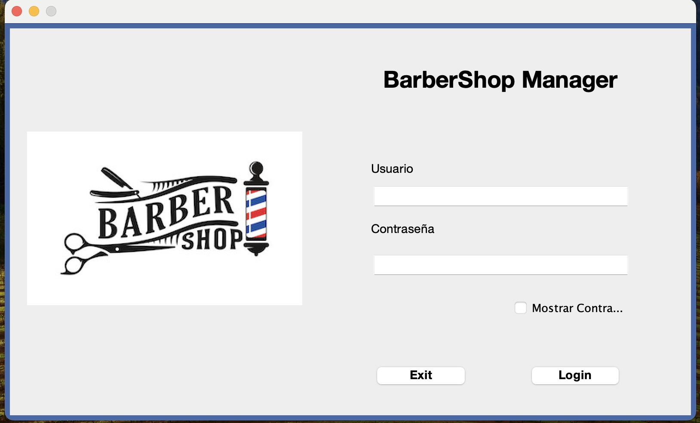
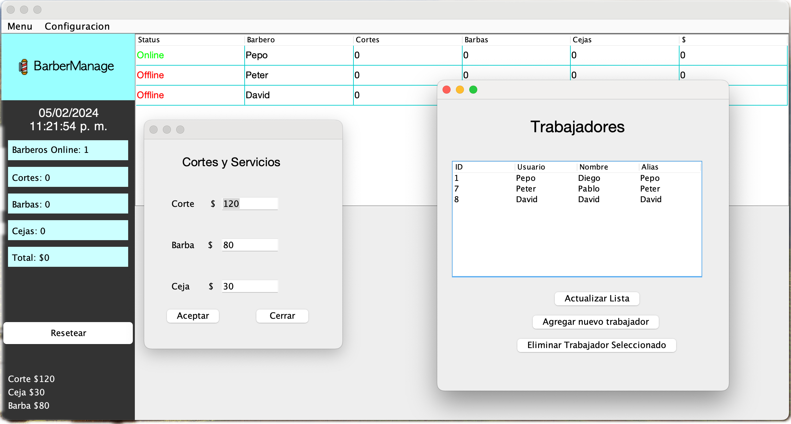

#  BarberManagementPC

Manage your babershop by checking what your employees are doing, Active or inactive you will be able to remotly manage your buisness.  
Database used > https://freedb.tech  
Programming Language > Java  
IDE > Apache Netbeans  
SQL IDE > mySQLWorkbench

## Screenshots

